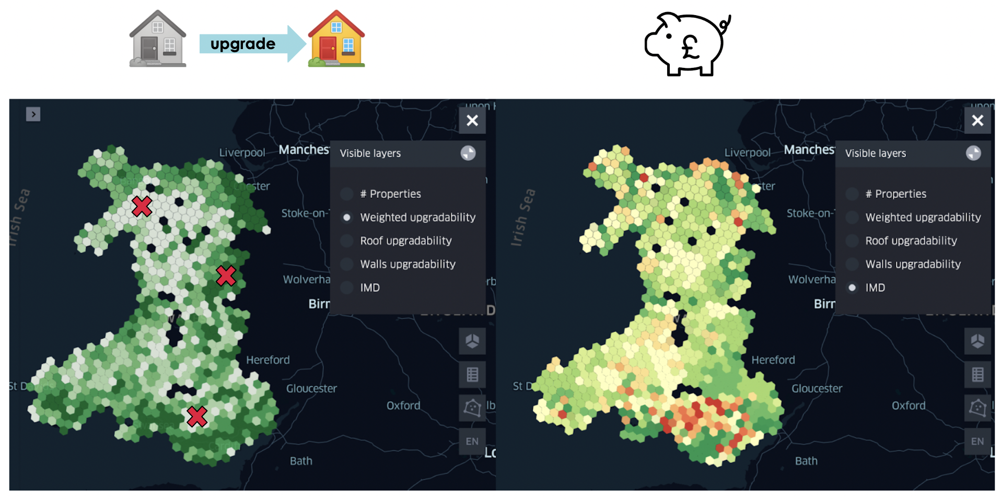
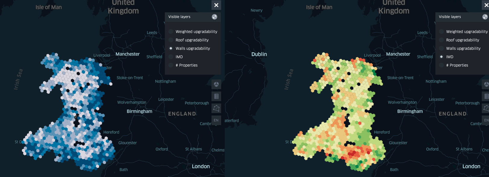

# Upgradability Maps

The Sustainable Future team at Nesta is designing a new retrofit loan together with the Development Bank Wales. In this context, we attempted to measure and predict the upgradability of properties in order to identify suitable areas to launch a pilot.

Based on properties with multiple EPC records over time and EPC recommendations, we have developed a simple tool for predicting the general upgradability of a property, as well as individual upgradability scores for walls and roof retrofit measures. Other categories, such as windows or heating upgradability scores, will follow at a later stage.

This <a href="Upgradability.html" title="Upgradability Map">interactive map</a> allows you to explore various upgradability scores: the brighter, the more 'upgradable' are the properties on average in this area. When paired with the the number of properties (based on EPC) or the Index of Multiple Deprivation (IMD), these maps can provide insights into where a retrofit loan (e.g. including roof and walls upgrades) would ideally be tested.

A work-in-progress solution for analysing upgradability on local authorities level can be found <a href="LA_Upgradability.html" title="Upgradability Map">here</a>.
